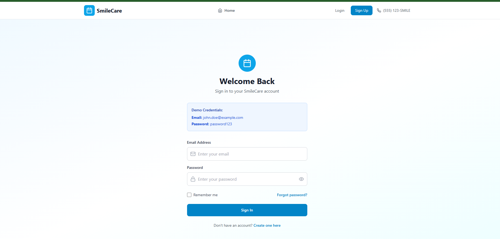

# Dental Appointment Scheduling System 🦷

A full-stack web application that allows patients to register, log in, schedule dental appointments, and view appointment details. Built using React, Node.js, Express, MySQL, and JWT for authentication.

## 🌐 Live Demo

Coming soon...

## 📸 Screenshots




## 🚀 Features

- User registration and login with JWT authentication
- Secure password hashing with bcrypt
- Schedule new appointments
- View existing appointments
- Admin panel (optional)
- CORS and cookie-based authentication support
- Hosted on AWS (EC2, S3, CloudFront, RDS)

## 🧰 Tech Stack

**Frontend:**
- React
- Vite
- Axios
- Tailwind CSS

**Backend:**
- Node.js
- Express
- MySQL
- JWT (JSON Web Tokens)
- bcrypt

**Deployment:**
- AWS EC2 (backend)
- AWS S3 + CloudFront (frontend)
- Cloudflare (DNS & SSL)

## 📦 Installation

### Prerequisites

- Node.js and npm
- MySQL

### Backend Setup

```bash
cd backend
npm install
